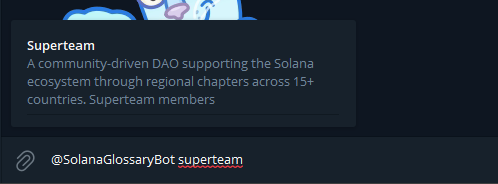
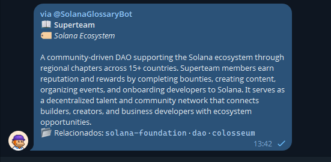
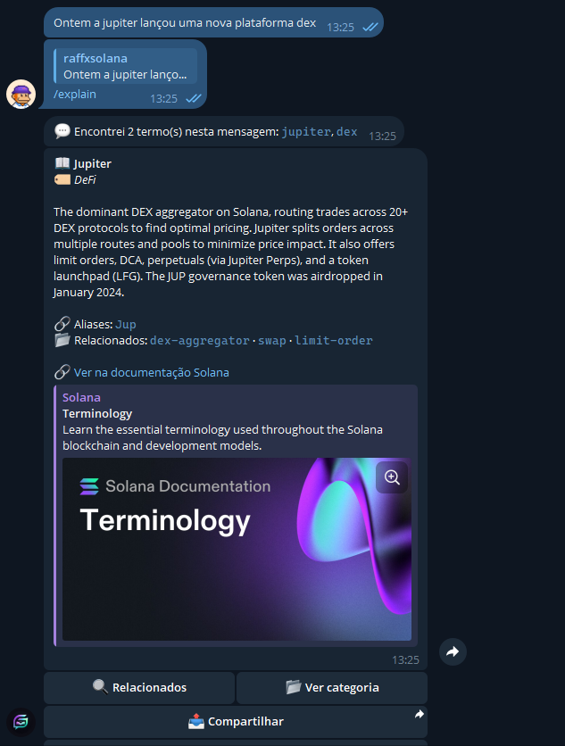
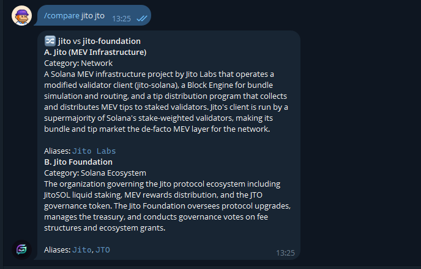
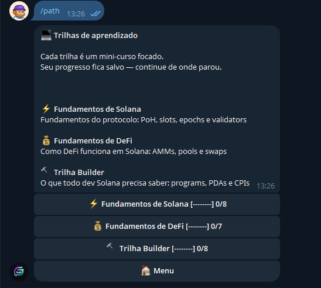
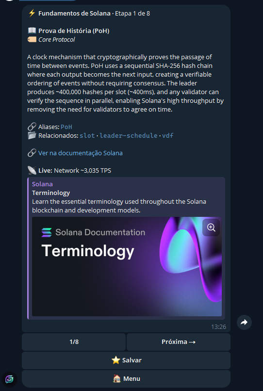
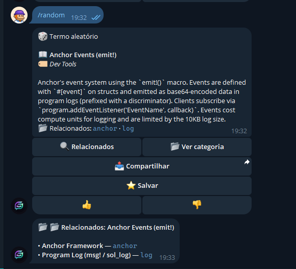
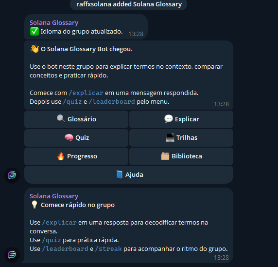

# Solana Glossary Bot

A Telegram-native onboarding and learning bot for Solana communities.

This project was built for the Solana Glossary bounty with a clear thesis: the best glossary is not just a website or a search box, but a product that teaches people where Solana communities already live. In practice, that means Telegram DMs for personal study and Telegram groups for contextual, in-chat learning.

- Live bot: `https://t.me/SolanaGlossaryBot`
- Production healthcheck: `https://solana-glossary-production.up.railway.app/`
- Repository: `https://github.com/lrafasouza/solana-glossary`

## Overview

Most Solana onboarding still breaks the conversation:

- a newcomer sees an unfamiliar term in a Telegram chat
- they leave the chat to search docs, Twitter, or random threads
- moderators repeat the same explanations again and again
- static glossaries help as references, but not as live learning tools

Solana Glossary Bot keeps the learning loop inside Telegram.

It supports two distinct product surfaces:

- **DM mode** for direct lookup, guided learning, quiz practice, progress tracking, favorites, history, and daily discovery
- **Group mode** for reply-to-explain, contextual teaching in active chats, group onboarding, and social retention loops like group streaks and local leaderboards

It also supports a lightweight sharing surface:

- **Inline mode** for pulling glossary cards directly into any Telegram conversation with `@SolanaGlossaryBot`

## Why This Bot Exists

The core problem is not lack of information. Solana already has docs, videos, threads, and glossaries. The real problem is delivery:

- people need explanations at the exact moment they get confused
- communities need a lightweight way to onboard new members without manual repetition
- learning should happen in the same product where the conversation is happening

This bot solves that by turning the glossary into an interactive Telegram product:

- instant term lookup in DMs
- reply-based explanation inside groups
- inline glossary sharing inside normal chats with friends
- multilingual onboarding in English, Portuguese, and Spanish
- habit-forming learning loops through quiz, streaks, daily term, favorites, history, and leaderboards

## Why It Stands Out In The Bounty

Many strong bounty submissions focus on search UIs, graph visualizations, MCP backends, quiz apps, or data expansion pipelines. This bot takes a different angle:

- it is **Telegram-native**, not a detached web surface
- it treats **DM and group chat as different learning environments**
- it is designed for **community onboarding**, not only individual reference lookup
- it combines **reference + guided learning + retention**
- it is **multilingual by default**, which matters for LATAM and global Solana communities

The differentiator is not just that the bot can answer glossary queries. The differentiator is that it helps communities teach, onboard, and retain learners inside the conversation itself.

## What Users Can Do

Today the bot supports:

- direct glossary lookup with multilingual aliases
- free-text glossary search in DMs
- reply-to-explain in conversations
- side-by-side concept comparison
- category browsing and related-term exploration
- guided learning paths with saved progress
- quiz flows with streaks and ranking
- favorites and recent history
- random discovery and daily term habits
- group onboarding and group progress loops
- inline mode in any Telegram chat
- enriched term cards with live network or market context for selected concepts

## DM Experience

DM is the personal learning surface. It is optimized for self-serve exploration, repeat study, and progress tracking.

### Best DM flows

- Send a term like `pda`, `proof of history`, or `account model`
- Use `/glossary` for direct lookup
- Use `/path` to move through structured learning paths
- Use `/quiz` to reinforce recall
- Use `/favorites` and `/history` to revisit important concepts
- Use `/termofday` and `/random` for lightweight discovery
- Use `/streak`, `/leaderboard`, and `/rank` to track personal progress

### DM-specific behavior

- Free text messages in private chats are treated as glossary searches
- Personal progress is persisted in SQLite
- The DM experience works well as a solo learning loop: search, read, save, review, quiz, repeat

## Group Experience

Group mode is the community learning surface. It is optimized for active chats, shared context, and low-friction onboarding.

### Best group flows

- Reply to a message with `/explain` to decode Solana terms in context
- Use `/leaderboard` to see the top performers in that group
- Use `/streak` to see personal and group streak context together
- Use menus and onboarding prompts when the bot joins a new group
- Use `/quiz` for light shared learning without forcing users to leave the chat

### Group-specific behavior

- When the bot is added to a group, it can onboard the group and ask for language selection
- `/explain` is strongest in groups because it works on live conversation context
- `/leaderboard` becomes a local group leaderboard instead of a global ranking
- `/streak` includes group-level participation and group streak context
- The bot tracks group members and daily participation for social learning loops

## Inline Experience

Inline mode is the fastest way to pull glossary content into a live chat without asking your friend to leave the conversation.

### Best inline flow

- In any Telegram chat, type `@SolanaGlossaryBot pda`
- Telegram opens inline results from the bot
- Pick the matching glossary result
- Send the card directly into the conversation

### Inline-specific behavior

- Empty inline queries return random terms as inspiration
- Typed queries return the best glossary match or a close fallback
- Inline responses are optimized for speed, so they use the standard glossary card instead of slower live-enriched data
- Inline results are personal and language-aware

## Commands

### Core Commands

| Command | Aliases | Best Context | What It Does |
|---|---|---|---|
| `/start` | - | DM / Group | Starts onboarding |
| `/help` | - | DM / Group | Shows help and usage tips |
| `/language` | `/idioma` | DM / Group | Changes language |
| `/glossary` | `/glossario`, `/glosario` | DM | Direct glossary lookup |
| `/explain` | `/explicar` | Group-first | Explains terms in a replied message or direct input |
| `/compare` | `/comparar` | DM / Group | Compares two Solana concepts |

### Discovery And Learning

| Command | Aliases | Best Context | What It Does |
|---|---|---|---|
| `/path` | `/trilha` | DM | Opens guided learning paths |
| `/categories` | `/categorias` | DM / Group | Lists all categories |
| `/category` | `/categoria` | DM / Group | Shows one category |
| `/termofday` | `/termododia`, `/terminodelhoy` | DM | Shows the daily term |
| `/random` | `/aleatorio` | DM / Group | Returns a random term |
| `/quiz` | - | DM / Group | Starts quiz mode |

### Progress And Retention

| Command | Aliases | Best Context | What It Does |
|---|---|---|---|
| `/favorites` | `/favoritos` | DM | Lists saved terms |
| `/history` | `/historico`, `/historial` | DM | Shows recently viewed terms |
| `/streak` | `/sequencia` | DM / Group | Shows personal streak, and in groups also shows group streak context |
| `/leaderboard` | `/ranking` | DM / Group | Global ranking in DM, local ranking in groups |
| `/rank` | `/posicao` | DM | Shows your current global position |

### Usage Notes

- In private chats, plain text without `/` is treated as a glossary search
- `/explain` is most useful when replying to a group message
- Inline mode works with `@SolanaGlossaryBot <term>` in any Telegram chat
- `/compare` accepts two concepts separated by `vs`, `x`, comma, or pipe
- `/category` expects a category id such as `defi`, `security`, or `core-protocol`
- The bot supports English, Portuguese, and Spanish command aliases where implemented

## Example Journeys

### 1. New user in DM

1. The user opens the bot with `/start`
2. Chooses a language
3. Sends `pda`
4. Reads the glossary card and explores related concepts
5. Saves the term to favorites
6. Starts `/quiz` or `/path`

### 2. Newcomer confused in a group

1. Someone says "this needs a PDA and CPI flow"
2. A member replies to that message with `/explain`
3. The bot detects the terms and replies with glossary help
4. The group keeps learning without leaving Telegram

### 3. Daily learning habit

1. A user checks `/termofday`
2. Runs `/quiz`
3. Builds a streak
4. Tracks progress with `/streak`, `/rank`, and `/leaderboard`

### 4. Community moderator workflow

1. Add the bot to a Telegram group
2. Set group language
3. Use group onboarding prompts and menu navigation
4. Let the bot handle repeated "what does this term mean?" questions
5. Encourage lightweight engagement with quiz and ranking

### 5. Pulling a term into a chat with a friend

1. You are chatting with a friend in Telegram
2. Type `@SolanaGlossaryBot proof of history`
3. Telegram shows matching inline results from the bot
4. Select the glossary card you want
5. Send it directly into the conversation

## What Makes This Different

### Compared with a static glossary

- It works inside Telegram instead of sending users elsewhere
- It supports active learning, not only reading
- It preserves progress and creates repeat usage loops

### Compared with a web app

- It fits the actual communication channel used by communities
- It supports reply-to-explain directly on live messages
- It reduces friction for moderators and community leads

### Compared with a backend or MCP-only tool

- It is immediately usable by end users
- It is built around community UX, not only data access
- It turns glossary content into a habit-forming product

## Architecture

High-level flow:

1. Telegram sends updates to the bot
2. `grammY` routes commands, callbacks, text messages, inline queries, and group membership events
3. glossary lookup resolves terms from the vendored dataset
4. enriched term cards optionally add live market or network context
5. SQLite stores progress, favorites, history, streaks, quiz sessions, and group state
6. the app runs in long polling locally and webhook mode in production

### Stack

- TypeScript
- Node.js
- grammY
- `@grammyjs/i18n`
- Express
- `better-sqlite3`
- SQLite
- Railway

## Repository Structure

This repository contains both the glossary data/package and the Telegram bot app.

- Root package: `@stbr/solana-glossary`
- Telegram bot app: `apps/telegram-bot`
- Source glossary data: `data/terms/*.json`
- Bot-local glossary data: `apps/telegram-bot/src/glossary/data/terms/*.json`
- Localized glossary term files: `data/i18n/*.json`
- Bot UI locale files: `apps/telegram-bot/src/i18n/locales/*.ftl`

## Data And Persistence

The bot is powered by the Solana Glossary dataset vendored into the Telegram app for predictable deployment behavior.

Primary data sources:

- `data/terms/*.json`
- `apps/telegram-bot/src/glossary/data/terms/*.json`
- `apps/telegram-bot/src/glossary/index.ts`

Localized glossary content is served from:

- `apps/telegram-bot/src/glossary/data/i18n/pt.json`
- `apps/telegram-bot/src/glossary/data/i18n/es.json`

SQLite stores:

- user language preference
- favorites
- recent history
- daily activity and streak state
- quiz sessions and quiz drafts
- learning path progress
- leaderboard state
- group language and group membership
- group streaks and group daily participation
- scheduled notifications

## Setup

Requirements:

- Node.js 22+
- a Telegram bot token from BotFather

Local development:

```bash
cd apps/telegram-bot

# macOS / Linux
cp .env.example .env

# Windows
copy .env.example .env

npm install
npm run dev
```

Set `BOT_TOKEN` in `apps/telegram-bot/.env` before starting the app.

Useful commands:

```bash
npm run build
npm test
npm run check:i18n
```

## Environment Variables

Reference env file:

- `apps/telegram-bot/.env.example`

| Variable | Required | Description | Example |
|---|---|---|---|
| `BOT_TOKEN` | Yes | Telegram bot token from BotFather | `123456789:ABC...` |
| `WEBHOOK_DOMAIN` | No in local dev, yes in production | Public base URL for webhook mode | `https://your-app.up.railway.app` |
| `PORT` | No | Server port, defaults to `3000` | `3000` |

Runtime behavior:

- if `WEBHOOK_DOMAIN` is empty, the bot uses long polling
- if `WEBHOOK_DOMAIN` is set, the app runs an Express server and registers Telegram webhook delivery at `/webhook`
- the healthcheck endpoint responds at `/`

## Deployment

Recommended Railway setup:

- Root Directory: `apps/telegram-bot`
- Build Command: `npm install && npm run build`
- Start Command: `node dist/server.js`
- Healthcheck Path: `/`

Required production environment variables:

```env
BOT_TOKEN=your_telegram_bot_token
WEBHOOK_DOMAIN=https://your-service.up.railway.app
```

## Screenshots

Current screenshots now cover the core product story for the bounty, including DM flows, learning paths, and group/community usage.

### Onboarding

The onboarding flow sets the tone quickly: language selection, a clear starting point, and an immediate path into glossary search and guided usage.


### DM Lookup

Direct lookup in DM is the fastest solo-learning entrypoint. Users can search a term, read the card, and continue exploring without leaving Telegram.


### Inline Mode

Inline mode is the shareable surface: type `@SolanaGlossaryBot <term>` in a normal conversation, choose a result, and send the glossary card into the chat with a friend.




### Explain

`/explain` is the strongest group-learning feature. It turns a live message into an instant teaching moment without breaking the conversation flow.



### Compare

Comparison helps users understand similar concepts side by side, which is especially useful for onboarding devs and advanced learners.



### Categories

Category browsing gives structure to the glossary and helps users move from one-off lookup into deeper exploration by domain.


### Learning Paths

Learning paths turn the glossary into a guided curriculum, making the bot useful not only for lookup but also for progressive education.




### Quiz

Quiz mode transforms passive reading into active recall and creates a natural retention loop inside Telegram.


### Favorites

Favorites make the bot practical for repeated study by letting users save high-value concepts for later review.


### Random Discovery

Random discovery gives users a lightweight way to keep learning even when they do not know what to search for next.


### Related Terms

Related-term navigation helps users follow the concept graph naturally and understand how Solana ideas connect.



### Daily Term

The daily term creates a simple recurring habit and gives the product a low-friction “come back every day” loop.


### Streak And Leaderboard

Streaks and leaderboard mechanics add progression and light competition, reinforcing retention for both individuals and communities.


### Group Onboarding

Group onboarding shows the bot working as a community tool, not just a private assistant, with prompts that help teams adopt it inside shared chats.



## Contributing

See `CONTRIBUTING.md` for glossary data contribution rules, validation steps, and category conventions.

## Final Note

For the bounty, the main claim of this project is simple:

the glossary becomes more useful when it stops being only a dataset or a website and starts working as a live learning layer inside the conversations where Solana communities already teach.
