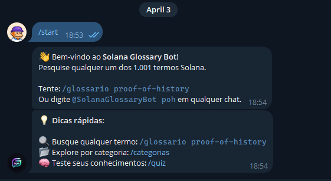
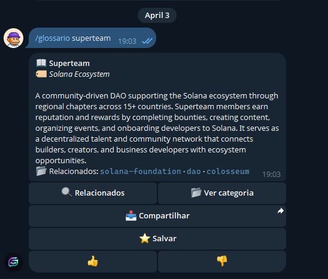
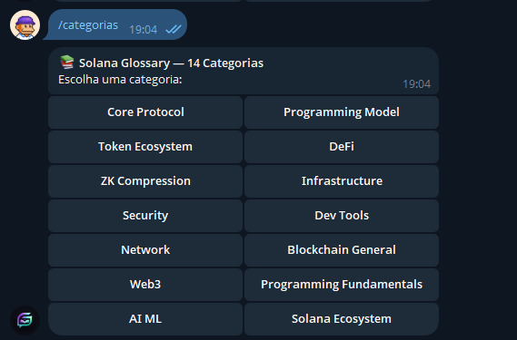
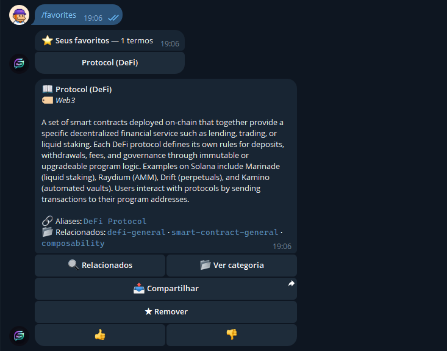
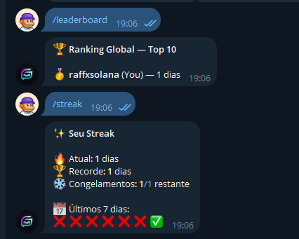

# Solana Glossary Telegram Bot

A multilingual Telegram bot that turns the Solana Glossary into a fast, conversational learning tool for developers, learners, and ecosystem users.

It makes Solana terminology easier to search, revisit, and retain through Telegram-native flows like free-text search, category exploration, daily learning, quiz mode, favorites, history, streaks, and leaderboard mechanics.

## Live Demo

- Telegram bot: `https://t.me/SolanaGlossaryBot`
- Live health endpoint: `https://solana-glossary-production.up.railway.app/`
- Deployment: Railway
- Runtime: Telegram webhook bot

## Why this project exists

Most glossary products are passive. You open a page, search once, read a definition, and leave.

This project turns the Solana Glossary into an active learning product:

- faster access inside Telegram
- repeated learning through daily usage
- lightweight retention loops through quiz and streaks
- multilingual onboarding for `pt`, `en`, and `es`
- portable live demo that can be used immediately

The goal is not just to expose glossary data, but to make the data genuinely useful in a daily developer workflow.

## What it does

- Search terms with `/glossary`, `/glossario`, `/glosario`
- Search through free-text DMs
- Browse glossary categories
- Use inline mode in any Telegram chat
- Learn with a daily term flow
- Test knowledge with multiple-choice quizzes
- Save favorite terms
- Review recently viewed terms
- Track streaks and rank on a leaderboard
- Switch language between Portuguese, English, and Spanish

## Why it matters

This bot solves a real discovery and retention problem:

- new developers can learn Solana concepts without leaving Telegram
- experienced devs can quickly clarify specific terms while chatting or building
- communities can share terms and use inline mode as a lightweight learning primitive
- multilingual support lowers the barrier for LATAM users

That makes it more than a thin wrapper. It is a glossary-powered learning surface with retention mechanics.

## Glossary SDK / Data Integration

This project is built on top of the official Solana Glossary data layer.

Source of truth:

- `data/terms/*.json`
- glossary i18n data used for localized term content

To make deployment reliable on Railway, the bot vendors a deployable snapshot of the official glossary dataset inside the app:

- `apps/telegram-bot/src/glossary/index.ts`
- `apps/telegram-bot/src/glossary/types.ts`
- `apps/telegram-bot/src/glossary/data/`

This keeps the project compliant with the campaign rule requiring usage of `@stbr/solana-glossary` or its official data files, while also making the deployment standalone and production-friendly.

## User Experience

### Search and learn

- User sends `/glossary proof-of-history`
- Bot returns a formatted glossary card
- User can jump to related terms from inline buttons

### Explore by category

- User opens `/categories`
- Bot lists the glossary categories
- User navigates paginated category term lists

### Daily learning

- User runs `/termofday`
- Bot returns the daily term
- Repeated visits create a learning rhythm

### Quiz and retention

- User starts `/quiz`
- Bot shows a multiple-choice question
- Correct answers advance streaks and leaderboard position

### Personal knowledge memory

- Favorites keep important terms handy
- History makes it easy to revisit previously seen terms
- Leaderboard adds a lightweight social loop

## Commands

### English

- `/start`
- `/glossary <term>`
- `/random`
- `/categories`
- `/termofday`
- `/quiz`
- `/favorites`
- `/history`
- `/streak`
- `/leaderboard`
- `/rank`
- `/language pt|en|es`
- `/help`

### Portuguese

- `/start`
- `/glossario <termo>`
- `/aleatorio`
- `/categorias`
- `/termododia`
- `/quiz`
- `/favoritos`
- `/historico`
- `/streak`
- `/leaderboard`
- `/posicao`
- `/idioma pt|en|es`
- `/help`

### Spanish

- `/start`
- `/glosario <termino>`
- `/aleatorio`
- `/categorias`
- `/terminodelhoy`
- `/quiz`
- `/favoritos`
- `/historial`
- `/streak`
- `/leaderboard`
- `/idioma pt|en|es`
- `/help`

## Screenshots / Assets

These screenshots show the bot running in Telegram and demonstrate the core product flows.

### Onboarding




### Search



### Categories



### Quiz


### Favorites



### Streak and Leaderboard



## Architecture

Main app path:

- `apps/telegram-bot`

Key files:

- `apps/telegram-bot/src/server.ts` for webhook server and production startup
- `apps/telegram-bot/src/bot.ts` for middleware, commands, callbacks, and inline mode
- `apps/telegram-bot/src/glossary/index.ts` for glossary lookup and search
- `apps/telegram-bot/src/db/index.ts` for SQLite persistence
- `apps/telegram-bot/src/scheduler/notifications.ts` for reminder scheduling

High-level structure:

```text
apps/telegram-bot/
|- src/
|  |- bot.ts
|  |- server.ts
|  |- commands/
|  |- handlers/
|  |- i18n/
|  |- glossary/
|  |- db/
|  |- scheduler/
|  `- utils/
|- tests/
|- assets/
|- package.json
|- package-lock.json
|- railpack.toml
`- nixpacks.toml
```

## Internationalization

Supported languages:

- Portuguese
- English
- Spanish

Locale files:

- `apps/telegram-bot/src/i18n/locales/en.ftl`
- `apps/telegram-bot/src/i18n/locales/pt.ftl`
- `apps/telegram-bot/src/i18n/locales/es.ftl`

This directly supports one of the campaign bonus factors: high-quality i18n.

## Local Development

### Requirements

- Node.js 22+
- Telegram bot token from `@BotFather`

### Environment

Reference:

- `apps/telegram-bot/.env.example`

Example:

```env
BOT_TOKEN=your_bot_token
WEBHOOK_DOMAIN=
PORT=3000
```

For local development, leave `WEBHOOK_DOMAIN` empty. The app will use long polling instead of webhook mode.

### Install

```bash
cd apps/telegram-bot
npm install
```

### Run in development

```bash
npm run dev
```

### Build

```bash
npm run build
```

### Start production build locally

```bash
npm start
```

### Tests

```bash
npm test
```

## Railway Deployment

Recommended Railway service configuration:

- Root Directory: `apps/telegram-bot`
- Builder: `Railpack`
- Build Command: `npm install && npm run build`
- Start Command: `node dist/server.js`
- Public Port: `8080`
- Healthcheck Path: `/`

Required environment variables:

```env
BOT_TOKEN=your_telegram_bot_token
WEBHOOK_DOMAIN=https://your-service.up.railway.app
```

Notes:

- Do not append `/webhook` to `WEBHOOK_DOMAIN`
- Railway provides `PORT` automatically
- The app sets the Telegram webhook to `${WEBHOOK_DOMAIN}/webhook`

## Persistence Notes

The bot currently uses SQLite for:

- favorites
- history
- quiz sessions
- streaks
- scheduled notifications

Default local database path:

- `data/bot.db`

Optional override:

```env
BOT_DB_PATH=/app/data/bot.db
```

Important production note:

- Railway containers are ephemeral by default
- without persistent storage, user progress may be lost on restart or redeploy

For a stronger production setup, mount persistent storage or migrate state to Postgres.

## Tech Stack

- TypeScript
- Node.js
- grammY
- @grammyjs/i18n
- Express
- better-sqlite3
- node-cron
- Railway

## Why This Submission Stands Out

- Solves a real onboarding and recall problem inside Telegram
- Supports Portuguese, English, and Spanish for broader accessibility
- Goes beyond a static glossary by adding quiz, streak, favorites, history, and leaderboard loops
- Is grounded in the official Solana Glossary data layer and localized glossary content
- Ships with a live deployed demo on Railway

## Known Limitations

- SQLite persistence is not durable on Railway without extra storage
- the live HTTP endpoint is a health surface, not a browser UI

## Next Improvements

- add persistent storage
- add the final demo video link
- add PR and X / Twitter links after publication
- improve timezone-aware scheduling
- expand visual assets and onboarding polish

## Submission Assets

### Live Demo

- `https://t.me/SolanaGlossaryBot`
- `https://solana-glossary-production.up.railway.app/`

### Video Demo

- Coming soon
- Recommended content:
  - onboarding
  - language selection
  - glossary search
  - category browsing
  - quiz mode
  - favorites / history
  - streak / leaderboard

### Pull Request

- Coming soon

### X / Twitter Post

- Coming soon

### Repository

- `https://github.com/lrafasouza/solana-glossary`

### Submission Summary

This submission turns the Solana Glossary into a multilingual Telegram-native learning product instead of a static reference page. The bot supports free-text search, glossary lookup commands, category browsing, inline mode, daily terms, quizzes, favorites, history, streaks, and leaderboard mechanics. It is deployed live on Railway, supports Portuguese, English, and Spanish, and is grounded in the official Solana Glossary data layer. The goal is to improve onboarding, recall, and glossary accessibility for Solana developers and learners.

## Repository Notes

This repository also contains the underlying glossary dataset and supporting code used by the bot. The submission itself is the Telegram bot experience implemented under `apps/telegram-bot`.

## License / Attribution

This project builds on the Solana Glossary dataset and localized content from the parent glossary repository.
