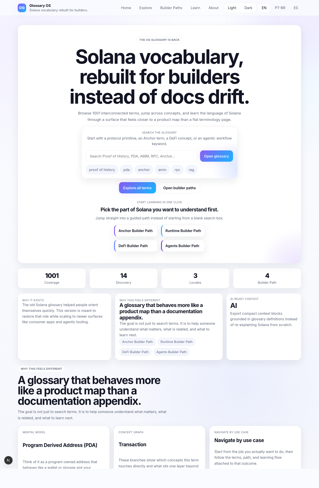
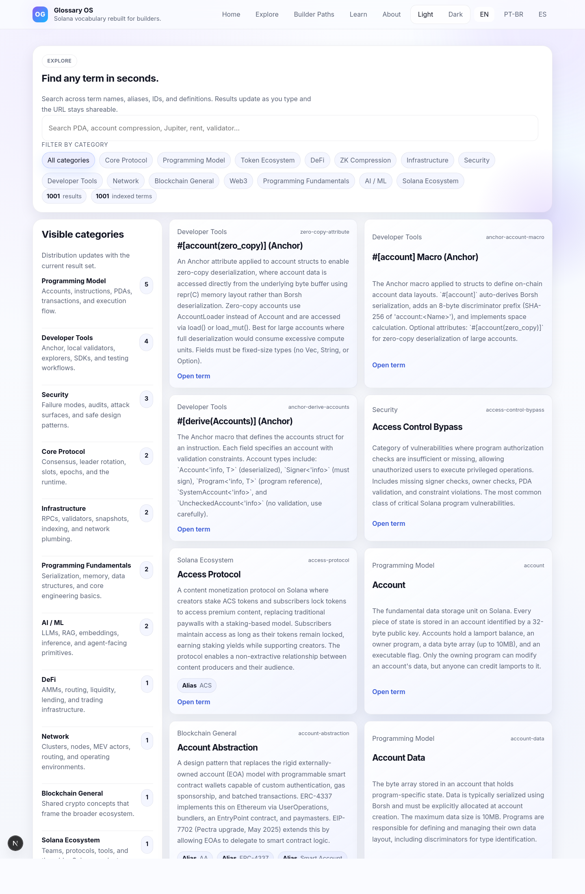
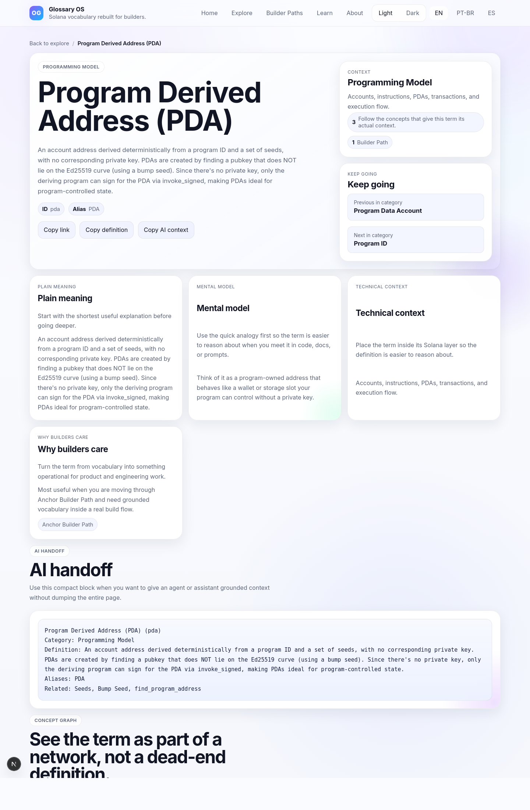
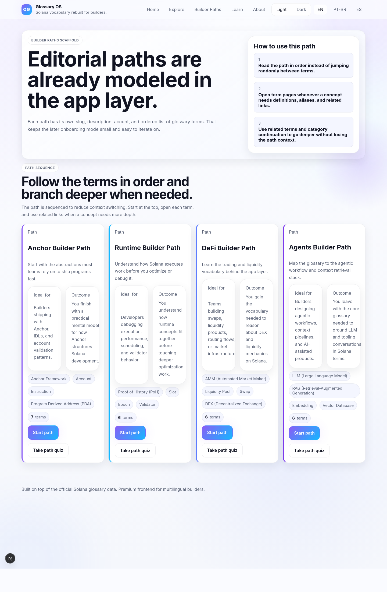
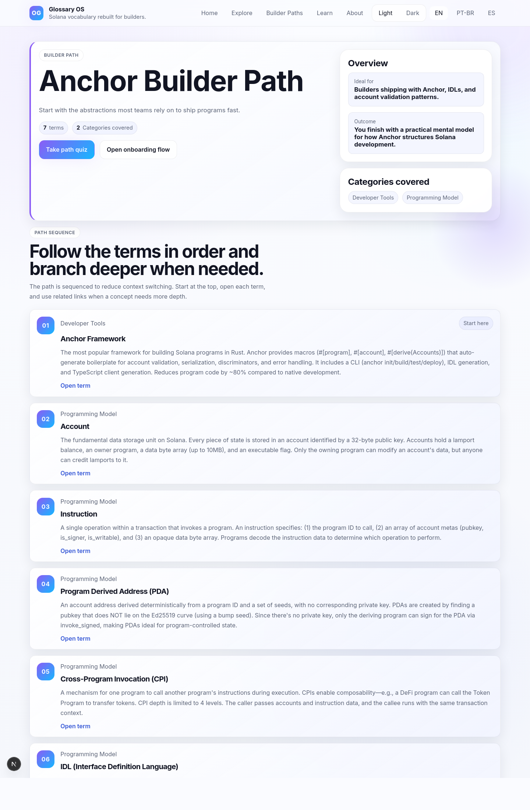

# Glossary OS

Glossary OS is a frontend that transforms the Solana Glossary into a structured product for discovery, onboarding, and builder workflows.

Instead of presenting glossary terms as a static list, it provides a multilingual navigation system with contextual learning, concept relationships, and guided exploration.

## Live Demo

https://solana-glossary-two.vercel.app/en

## Overview

Glossary OS enhances the official glossary dataset by turning it into an interactive experience. It supports both new developers and experienced builders through guided learning, use-case navigation, and AI-ready context export.

The platform is designed to scale with new terms through expansion tooling and reviewed contributions.

## Features

- Instant search across all glossary terms  
- Contextual term pages with:
  - aliases
  - related concepts
  - commonly confused terms
  - next-step exploration  
- Mental models to explain concepts intuitively  
- Concept graph navigation based on term relationships  
- Builder paths for:
  - Runtime
  - Anchor
  - DeFi
  - Agents  
- Use-case navigation for practical workflows  
- Interactive quizzes for onboarding and reinforcement  
- Multilingual support: `en`, `pt`, `es`  
- Dark and light mode  
- AI-ready context export (`Copy context for AI`)  
- Data expansion tooling with reviewed glossary contributions  

## Routes

- `/en` — Home  
- `/en/explore` — Exploration interface  
- `/en/term/[slug]` — Term detail page  
- `/en/paths` — Builder paths overview  
- `/en/paths/[path]` — Builder path detail  
- `/en/learn` — Learning interface (quizzes)  
- `/en/about` — Project information  

## Value Proposition

- Improves onboarding through structured learning and guided exploration  
- Enables deeper understanding via relationships between concepts  
- Supports real-world workflows with use-case navigation  
- Keeps the glossary evolving through contribution and expansion tooling  
- Integrates directly with AI workflows via structured context export  

## Screenshots

### Landing


### Explore


### Term Page


### Builder Paths


### Builder Path Detail


## Local Setup

```bash
npm install
npm run dev:web
```
## Validation

```bash
npm run validate
npm test
npm run typecheck:web
npm run build --workspace @stbr/glossary-os
```

