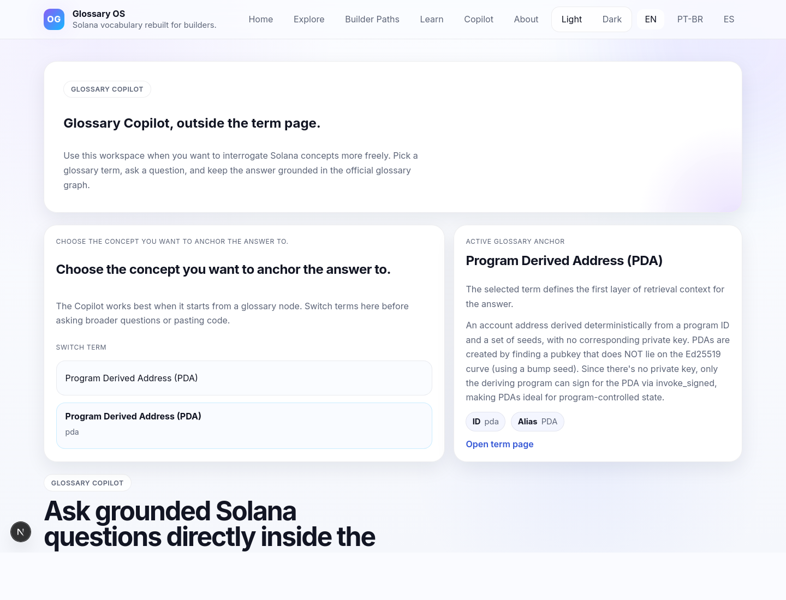
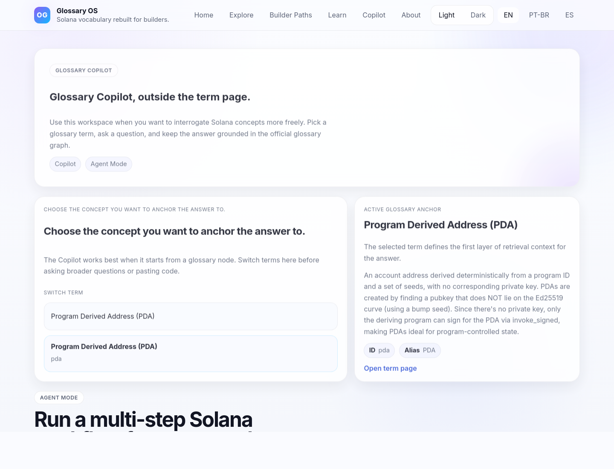
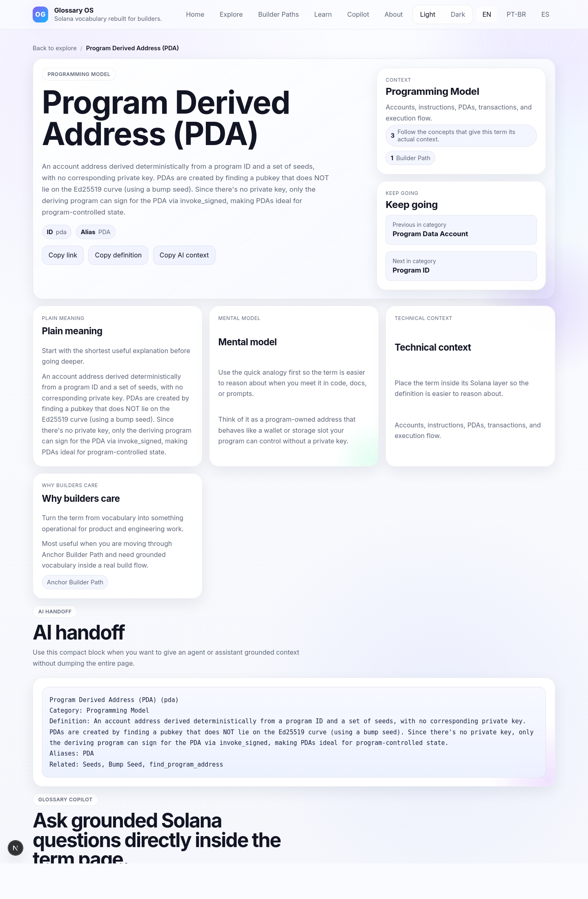

# Glossary OS

Glossary OS turns the Solana Glossary into a developer product.

It combines:

- a multilingual glossary frontend
- connected term pages with relationships, confusables, and builder paths
- a glossary-grounded Copilot workspace
- an Agent Mode that runs a visible multi-step workflow from one build goal

## Live Demo

https://solana-glossary-two.vercel.app/en

## What The App Does

Glossary OS is not just a glossary browser and not just a generic chatbot.

The app uses glossary terms as structured grounding for:

- concept explanation
- code explanation
- developer guidance
- next-step navigation
- multi-step build workflows

The current product surface includes:

- `/[locale]` landing and onboarding
- `/[locale]/explore` term discovery
- `/[locale]/term/[slug]` detailed glossary pages
- `/[locale]/paths` builder paths
- `/[locale]/copilot` full Copilot workspace

Supported locales:

- `en`
- `pt`
- `es`

## Copilot Workspace

The Copilot workspace keeps one glossary term as the active anchor and lets the user ask grounded questions from there.

The current implementation uses the glossary dataset to inject:

- the active term definition
- aliases
- related concepts
- common confusions
- next-step terms
- mental models
- builder path hints

That means the answer is constrained by the glossary structure instead of behaving like a free-form chat tab.

## Agent Mode

Agent Mode lives inside the same Copilot workspace and orchestrates a visible workflow from one goal.

Example prompt:

```text
Build an Anchor program for a user vault with deposits and withdrawals.
```

The workflow currently runs:

1. `plan` through the existing `/api/copilot` endpoint
2. `generate` through the same grounded Copilot endpoint
3. `explain` on the generated code when a code block is returned
4. `debug` with deterministic local issue detection
5. `learn` by merging suggested next terms from previous steps

This is intentionally pragmatic:

- it reuses the current Copilot backend
- it keeps the flow visible in the UI
- it avoids inventing new backend routes just to simulate orchestration

## Screenshots

### Copilot Workspace


### Agent Mode


### Copilot Inline On Term Page


### Landing


### Explore


### Term Page


### Builder Paths


### Builder Path Detail


## Local Setup

From the repository root:

```bash
npm install
npm run dev:web
```

Open:

- `http://localhost:3000/en`
- `http://localhost:3000/pt`
- `http://localhost:3000/es`

## Gemini Setup

Create `apps/glossary-os/.env.local`:

```bash
GEMINI_API_KEY=your_api_key_here
GEMINI_MODEL=gemini-2.5-flash
```

`GEMINI_MODEL` is optional.

The application uses Gemini through the server-side route `/api/copilot`.

## Screenshot Capture

From the repository root:

```bash
npm run dev:web
npm run capture:screenshots --workspace @stbr/glossary-os
```

This captures the landing page, explore page, term page, inline Copilot, dedicated Copilot workspace, Agent Mode workspace, and builder path pages.

## Validation

```bash
npm run typecheck:web
npm run build --workspace @stbr/glossary-os
npm run test --workspace @stbr/glossary-os
```
