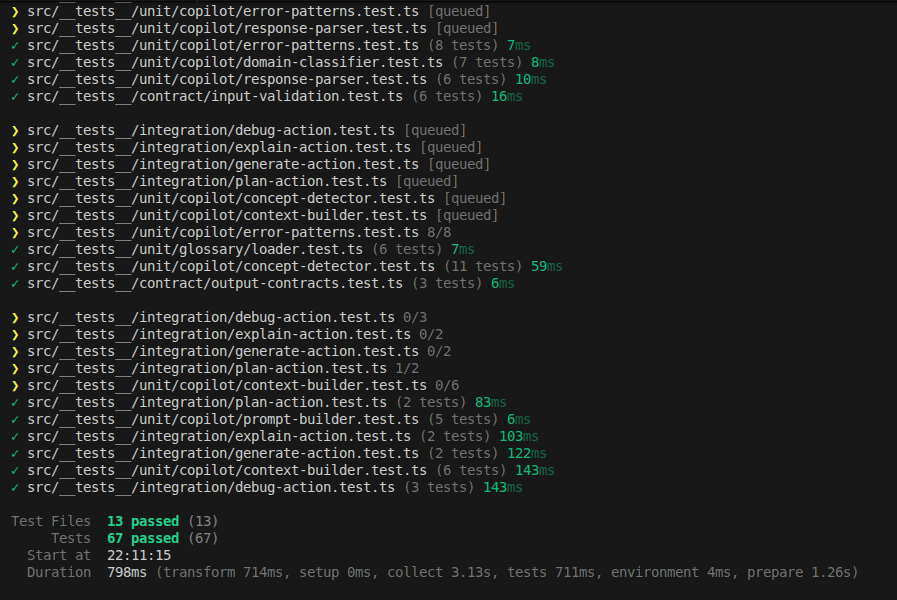

## What This Iteration Adds

**Making Glossary Copilot verifiable**.

The app now includes a dedicated Vitest suite that covers the Copilot stack across:

- **unit tests**
  - concept detection
  - domain classification
  - error pattern matching
  - response parsing
  - prompt building
  - context building
  - glossary shared utilities
- **integration tests**
  - explain flow
  - debug flow
  - generate flow
  - plan flow
- **contract tests**
  - `/api/copilot` input validation
  - structured Copilot output handling

Current test result:

- **13 test files**
- **65 passing tests**

## Why The Test Suite Matters

Glossary Copilot is not a static UI layer. It depends on:

- glossary context assembly
- code and text concept detection
- mode-specific prompt construction
- structured JSON parsing
- API input validation
- Gemini integration boundaries

Without dedicated tests, regressions in those layers are easy to miss. This suite makes Copilot quality visible to maintainers, reviewers, and hackathon judges.

## What The Suite Verifies

The suite validates the current Copilot contract in this branch:

- request validation in `/api/copilot`
- grounded glossary context assembly for the current term
- code-aware and question-aware context expansion
- structured parsing helpers used by the Copilot stack
- end-to-end Gemini request/response handling at the `fetch` boundary

This keeps the PR scoped to **verification of the existing Copilot implementation**, instead of turning the test PR into a larger product refactor.

## Copilot Flows Covered By The Suite

The current test suite validates the Copilot logic behind these flows.

### Tests




## Test Layout

The suite lives in [`src/__tests__`](/home/paolla/repos/solana/solana-glossary/apps/glossary-os/src/__tests__):

- [`fixtures/code-samples.ts`](/home/paolla/repos/solana/solana-glossary/apps/glossary-os/src/__tests__/fixtures/code-samples.ts)
- [`fixtures/error-messages.ts`](/home/paolla/repos/solana/solana-glossary/apps/glossary-os/src/__tests__/fixtures/error-messages.ts)
- [`fixtures/mock-gemini.ts`](/home/paolla/repos/solana/solana-glossary/apps/glossary-os/src/__tests__/fixtures/mock-gemini.ts)
- [`unit/copilot/concept-detector.test.ts`](/home/paolla/repos/solana/solana-glossary/apps/glossary-os/src/__tests__/unit/copilot/concept-detector.test.ts)
- [`unit/copilot/context-builder.test.ts`](/home/paolla/repos/solana/solana-glossary/apps/glossary-os/src/__tests__/unit/copilot/context-builder.test.ts)
- [`unit/copilot/domain-classifier.test.ts`](/home/paolla/repos/solana/solana-glossary/apps/glossary-os/src/__tests__/unit/copilot/domain-classifier.test.ts)
- [`unit/copilot/error-patterns.test.ts`](/home/paolla/repos/solana/solana-glossary/apps/glossary-os/src/__tests__/unit/copilot/error-patterns.test.ts)
- [`unit/copilot/prompt-builder.test.ts`](/home/paolla/repos/solana/solana-glossary/apps/glossary-os/src/__tests__/unit/copilot/prompt-builder.test.ts)
- [`unit/copilot/response-parser.test.ts`](/home/paolla/repos/solana/solana-glossary/apps/glossary-os/src/__tests__/unit/copilot/response-parser.test.ts)
- [`unit/glossary/loader.test.ts`](/home/paolla/repos/solana/solana-glossary/apps/glossary-os/src/__tests__/unit/glossary/loader.test.ts)
- [`integration/explain-action.test.ts`](/home/paolla/repos/solana/solana-glossary/apps/glossary-os/src/__tests__/integration/explain-action.test.ts)
- [`integration/debug-action.test.ts`](/home/paolla/repos/solana/solana-glossary/apps/glossary-os/src/__tests__/integration/debug-action.test.ts)
- [`integration/generate-action.test.ts`](/home/paolla/repos/solana/solana-glossary/apps/glossary-os/src/__tests__/integration/generate-action.test.ts)
- [`integration/plan-action.test.ts`](/home/paolla/repos/solana/solana-glossary/apps/glossary-os/src/__tests__/integration/plan-action.test.ts)
- [`contract/input-validation.test.ts`](/home/paolla/repos/solana/solana-glossary/apps/glossary-os/src/__tests__/contract/input-validation.test.ts)
- [`contract/output-contracts.test.ts`](/home/paolla/repos/solana/solana-glossary/apps/glossary-os/src/__tests__/contract/output-contracts.test.ts)

## Local Setup

From the repository root:

```bash
npm install
npm run dev:web
```

## Gemini Setup

Create `apps/glossary-os/.env.local`:

```bash
GEMINI_API_KEY=your_api_key_here
GEMINI_MODEL=gemini-2.5-flash
```

`GEMINI_MODEL` is optional.

The application uses Gemini through the server-side route:

- `/api/copilot`

The test suite does **not** require real Gemini calls. It mocks the `fetch` boundary.

## Validation

```bash
npm run test --workspace @stbr/glossary-os
npm run typecheck:web
npm run build --workspace @stbr/glossary-os
```

## Main Files For This Iteration

- [`src/lib/copilot.ts`](/home/paolla/repos/solana/solana-glossary/apps/glossary-os/src/lib/copilot.ts)
- [`src/lib/copilot/concept-detector.ts`](/home/paolla/repos/solana/solana-glossary/apps/glossary-os/src/lib/copilot/concept-detector.ts)
- [`src/lib/copilot/domain-classifier.ts`](/home/paolla/repos/solana/solana-glossary/apps/glossary-os/src/lib/copilot/domain-classifier.ts)
- [`src/lib/copilot/error-patterns.ts`](/home/paolla/repos/solana/solana-glossary/apps/glossary-os/src/lib/copilot/error-patterns.ts)
- [`src/lib/copilot/prompt-builder.ts`](/home/paolla/repos/solana/solana-glossary/apps/glossary-os/src/lib/copilot/prompt-builder.ts)
- [`src/lib/copilot/response-parser.ts`](/home/paolla/repos/solana/solana-glossary/apps/glossary-os/src/lib/copilot/response-parser.ts)
- [`src/app/api/copilot/route.ts`](/home/paolla/repos/solana/solana-glossary/apps/glossary-os/src/app/api/copilot/route.ts)
- [`src/__tests__`](/home/paolla/repos/solana/solana-glossary/apps/glossary-os/src/__tests__)
- [`vitest.config.mts`](/home/paolla/repos/solana/solana-glossary/apps/glossary-os/vitest.config.mts)
