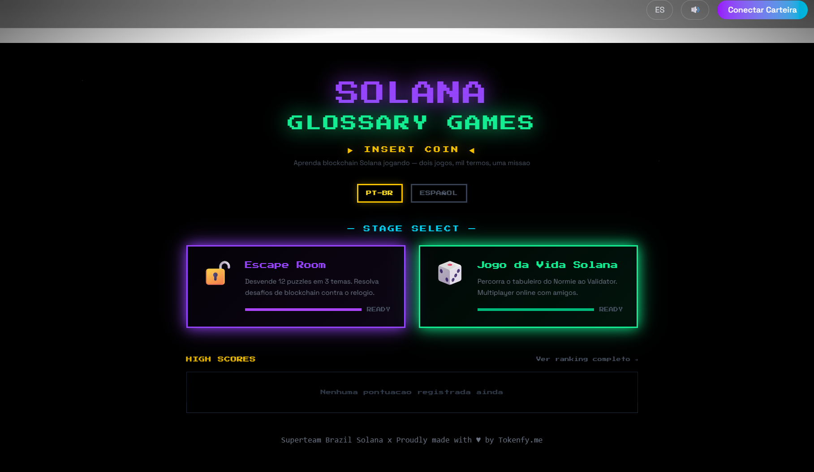
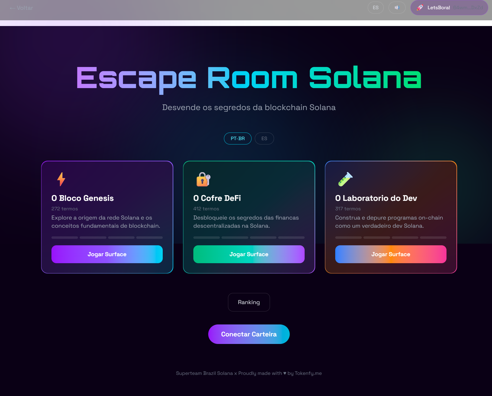
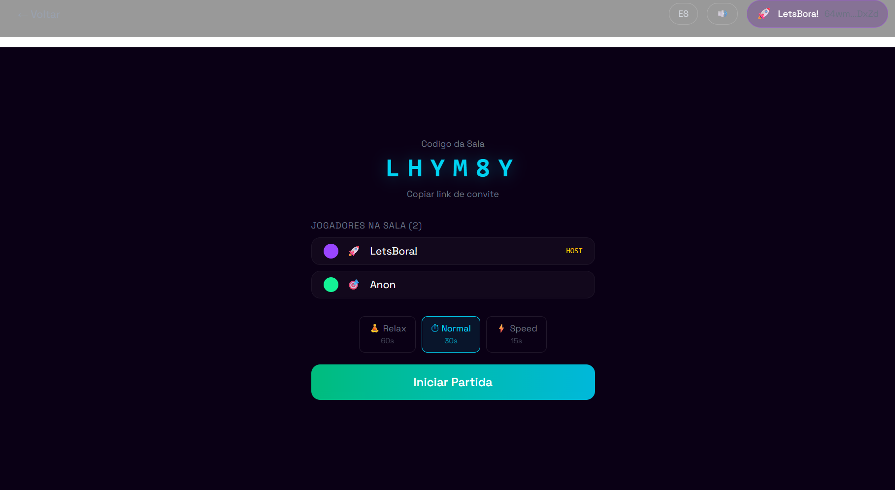
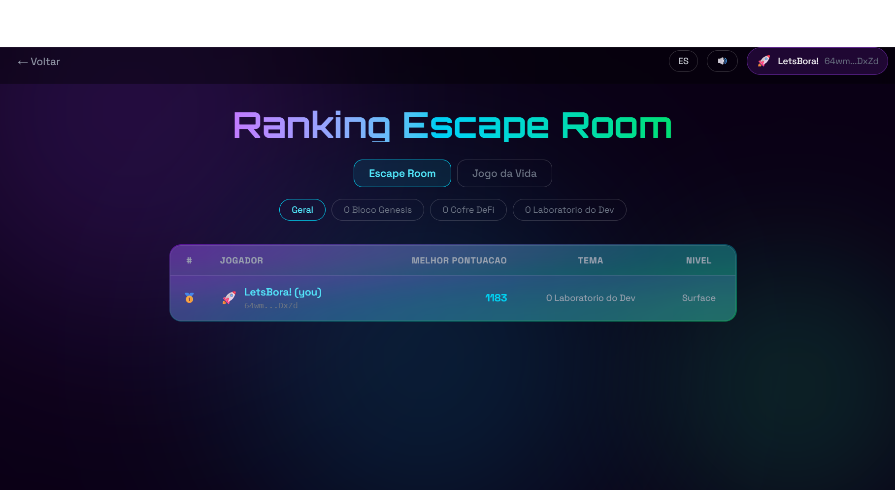
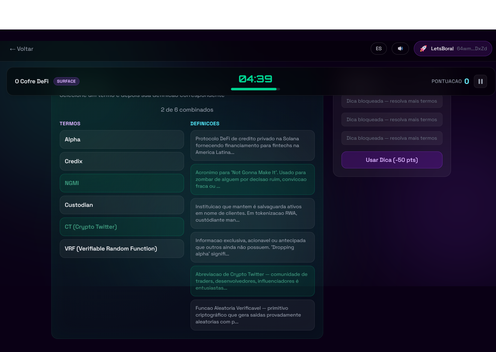
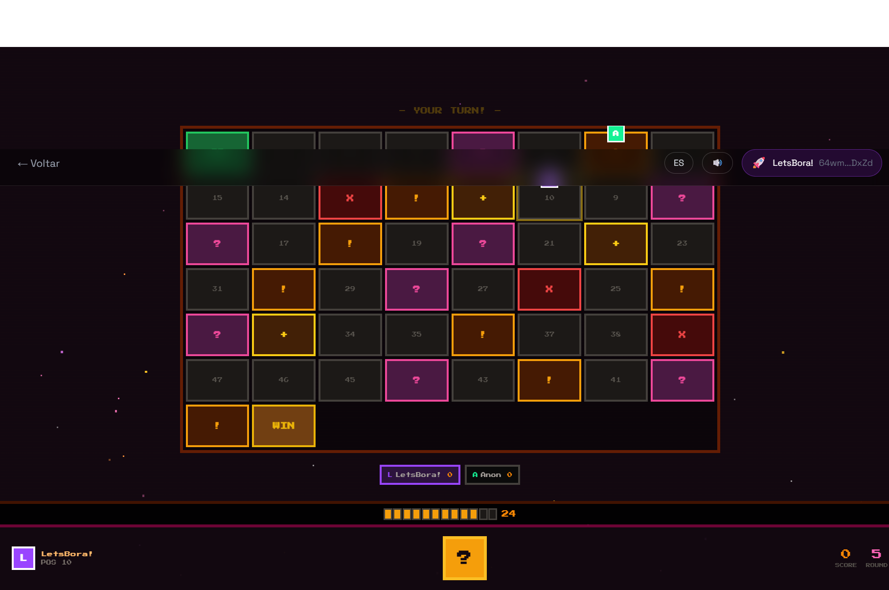
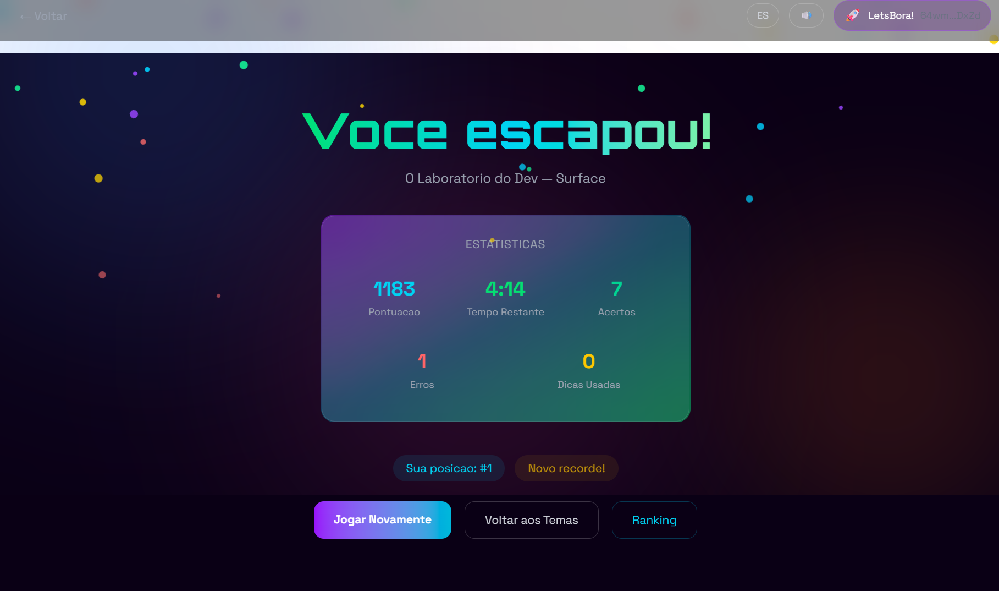
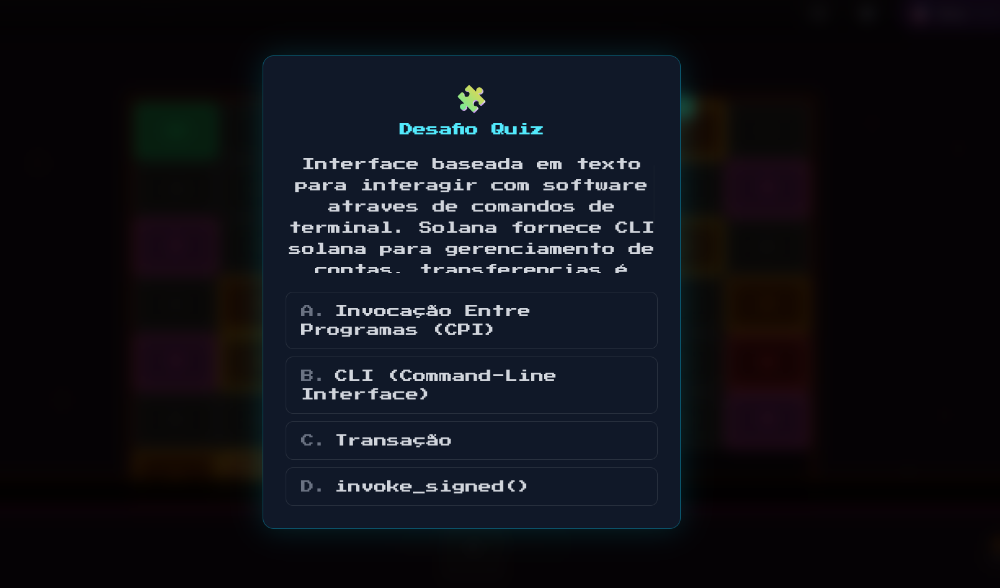

# Solana Glossary Games — Escape Room + Jogo da Vida

Two interactive educational games built on top of the `@stbr/solana-glossary` SDK with 1000+ Solana terms.

**Live Demo:** [https://aceleradora.eco.br/solanabr-glossario/](https://aceleradora.eco.br/solanabr-glossario/)

## Screenshots

| Portal | Escape Room | Jogo da Vida |
|--------|-------------|--------------|
|  |  |  |
|  |  |  |
| |  |  |

## Games

### Escape Room Solana

Solve 12 distinct puzzle types across 3 themes, each mapped to real Solana SDK categories:

| Theme | Categories | Puzzles |
|-------|-----------|---------|
| O Bloco Genesis | blockchain-general, core-protocol, network, infrastructure | MultipleChoice, TrueFalse, FillBlank, ConnectionWeb |
| O Cofre DeFi | token-ecosystem, defi, web3, solana-ecosystem | TermMatcher, CategorySort, DefinitionBuilder, OddOneOut |
| O Laboratorio do Dev | programming-model, dev-tools, programming-fundamentals, security | AliasResolver, RelatedTerms, CodeBreaker, TermTimeline |

- 4 difficulty levels per theme: Surface → Confirmation → Finality → Consensus
- Timer, hints system, score with time bonus, progressive unlock
- Synthesized 8-bit SFX + BGM via Web Audio API (zero mp3 files)
- Leaderboard with wallet-based ranking

### Jogo da Vida Solana

A multiplayer online board game (2-8 players) where you traverse a 50-space board learning Solana terms:

| Board | UX Style | Visual | Categories |
|-------|----------|--------|-----------|
| De Normie a Validator | Neon Cockpit — 2-column layout, circular glow nodes | Holographic HUD, cyan/violet neon | blockchain-general, core-protocol, network, infrastructure |
| Startup Solana | Terminal CLI — text-only interaction, vertical 5-col board | Green monochrome, matrix rain, `> execute roll()` | token-ecosystem, defi, web3, solana-ecosystem |
| A Timeline | Arcade 8-bit — bottom HUD, chunky pixel tiles | Press Start 2P font, segmented timer, pixel dice | programming-model, dev-tools, security |

Each board is a **completely different experience** — different layout, interaction patterns, fonts, backgrounds, and UX.

**Multiplayer features:**
- Online rooms via Supabase (create room → share 6-char code → play)
- Real-time turn sync (active player saves, others poll)
- Configurable turn timer (Relax 60s / Normal 30s / Speed 15s)
- Disconnect detection — 3 consecutive timeouts = player ejected
- Event cards and challenge quizzes with terms from the SDK
- Score submission to shared leaderboard

## SDK Integration

Both games use `@stbr/solana-glossary` extensively:

- `getTermsByCategory()` — selects terms for puzzles, events, and challenges
- `getLocalizedTerms()` — serves definitions in pt-BR and es
- All 14 SDK categories mapped across 3 themes per game
- `term.related[]` and `term.aliases[]` used in specialized puzzles (RelatedTerms, AliasResolver)
- Difficulty scaling by definition length (shorter = easier)

## Tech Stack

- **Framework:** Vite + React 18 + TypeScript
- **Styling:** Tailwind CSS v4 + Framer Motion
- **Multiplayer:** Supabase (rooms, game state sync, leaderboard)
- **Wallet:** @solana/wallet-adapter-react (Phantom, Solflare)
- **Audio:** Web Audio API (synthesized SFX + BGM, zero dependencies)
- **i18n:** react-i18next (pt-BR + es, 200+ translation keys)

## Setup

```bash
# Clone the repo
git clone https://github.com/lglucas/solana-glossary.git
cd solana-glossary/examples/escape-room-solana

# Install dependencies
npm install

# Configure environment (optional — works without Supabase for single-player)
cp .env.example .env.local
# Edit .env.local with your Supabase URL and anon key

# Run development server
npm run dev

# Build for production
npm run build
```

## Environment Variables

| Variable | Required | Description |
|----------|----------|-------------|
| `VITE_SUPABASE_URL` | For multiplayer | Supabase project URL |
| `VITE_SUPABASE_ANON_KEY` | For multiplayer | Supabase anonymous key |
| `VITE_SOLANA_RPC_URL` | For NFT avatars | Solana RPC endpoint (DAS-compatible) |

## Project Structure

```
src/
├── components/     # Shared components (Layout, WalletButton, Footer)
├── hooks/          # Shared hooks (useProfile, useTimer, useScore, useHints)
├── lib/            # Shared libs (audio, bgm, supabase, leaderboard, glossary)
├── pages/          # Shared pages (Portal, Home, Leaderboard, GamePlay, GameResult)
├── puzzles/        # 12 Escape Room puzzle components
│   └── shared/     # PuzzleShell, textUtils
├── engine/         # Escape Room engine (themes, puzzleRegistry, puzzleTypes)
├── locales/        # i18n (pt-BR.json, es.json)
└── vida/           # Jogo da Vida module
    ├── components/ # Board variants (Normie, Startup, Timeline), GameUi variants,
    │               # Lobby, Dice, EventCardModal, ChallengeModal, backgrounds
    ├── engine/     # Game engine (types, turns, board, dice, events, challenges,
    │               # themes, rooms)
    ├── hooks/      # useVidaGame (multiplayer sync, timer, auto-skip)
    └── pages/      # VidaPlay, VidaResult, VidaHome
```

## i18n

Full support for **Portuguese (pt-BR)** and **Spanish (es)**:
- 979 term definitions translated to pt-BR
- 1001 term definitions translated to es
- 200+ UI translation keys per language
- Language toggle in the header

## Credits

- **Developer:** Lucas Galvao ([@lg_lucas](https://twitter.com/lg_lucas)) — [Tokenfy.me](https://tokenfy.me)
- **Organization:** [Tokenfy.me](https://tokenfy.me)
- **SDK:** [@stbr/solana-glossary](https://github.com/solanabr/solana-glossary) by Superteam Brazil
- **Competition:** [Bring back the Solana Glossary](https://earn.superteam.fun) — Superteam Brazil 2026

> **Note:** The live demo is hosted at `aceleradora.eco.br`, a personal domain owned by @lg_lucas used solely for hosting personal projects. It is not affiliated with any organization.

## License

MIT
