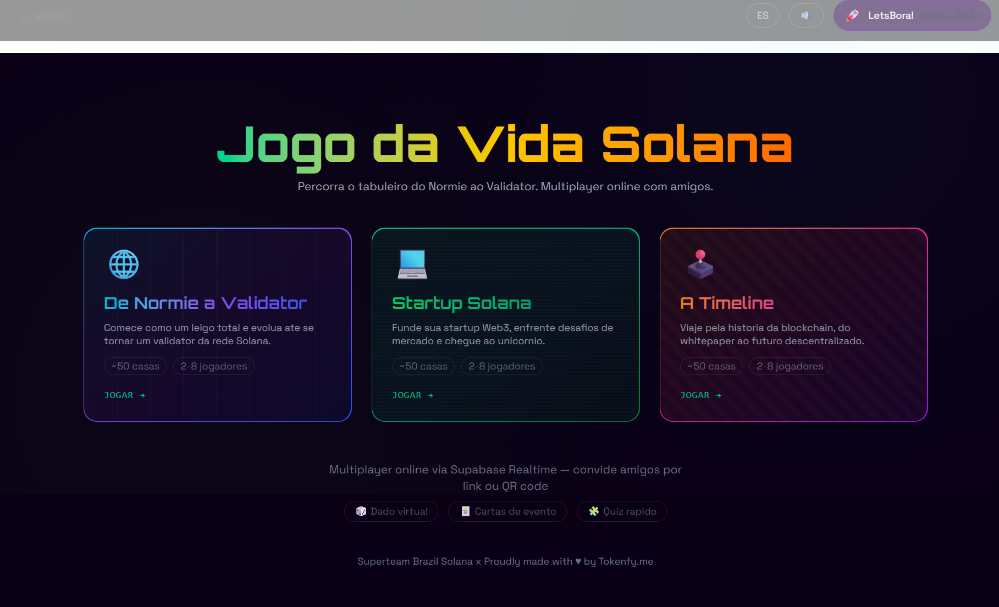
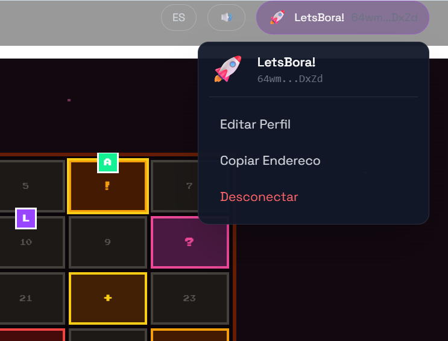

# Jogo da Vida Solana — Multiplayer Board Game

An online multiplayer board game (2-8 players) that teaches Solana ecosystem terms through gameplay. Part of the [Solana Glossary Games](../README.md) project.

**Live Demo:** [https://aceleradora.eco.br/solanabr-glossario/](https://aceleradora.eco.br/solanabr-glossario/) (click "Jogo da Vida" on the portal)

## Screenshots

| Board Selection | Lobby | Gameplay |
|----------------|-------|----------|
|  |  |  |
|  | |  |

## Overview

Players traverse a 50-space board, landing on event cards (that teach Solana terms), challenge quizzes (multiple-choice from the SDK), bonus and trap spaces. The first to reach the finish line wins.

Three boards with **completely different UX** — not just colors, but layout, interaction patterns, and game feel:

### De Normie a Validator (Neon Cockpit)
- 2-column layout: board left, dice + players right
- Circular glow nodes with neon trails
- Holographic glassmorphic HUD
- Categories: blockchain-general, core-protocol, network, infrastructure

### Startup Solana (Terminal CLI)
- Text-only interaction: `> execute roll()` instead of visual dice
- Vertical 5-column board (terminal log style)
- ASCII timer `[████████░░]`, process table player list
- Categories: token-ecosystem, defi, web3, solana-ecosystem

### A Timeline (Arcade 8-bit)
- Fixed bottom HUD bar (arcade status bar)
- 60x60px pixel dice button in the HUD
- 8-column chunky tile board, Press Start 2P font
- Categories: programming-model, dev-tools, security

## Multiplayer System

- **Room creation:** Host creates a room, gets a 6-character code
- **Invite:** Share code or link (`/vida/sala/{theme}/{code}`)
- **Sync model:** Active player computes locally and saves once; waiting players poll every 1.5s
- **Turn timer:** Host chooses Relax (60s) / Normal (30s) / Speed (15s)
- **Disconnect handling:** 3 consecutive timeouts = player ejected, game ends, inactive player excluded from ranking

## SDK Integration

Each board draws from distinct `@stbr/solana-glossary` categories:

- `getTermsByCategory()` — selects terms for event cards and challenge quizzes
- `getLocalizedTerms()` — serves definitions in pt-BR and es
- Event cards show the term, its definition, and apply a board effect (advance, retreat, bonus, penalty)
- Challenge quizzes are multiple-choice: definition → pick the correct term from 4 options

## Architecture

```
src/vida/
├── components/
│   ├── GameBoard.tsx       # Logic dispatcher (hooks, sync, navigation)
│   ├── GameUiNormie.tsx    # Neon cockpit UI
│   ├── GameUiStartup.tsx   # Terminal CLI UI
│   ├── GameUiTimeline.tsx  # Arcade 8-bit UI
│   ├── BoardNormie.tsx     # Circular neon node board (10 cols)
│   ├── BoardStartup.tsx    # Terminal cell board (5 cols)
│   ├── BoardTimeline.tsx   # Pixel tile board (8 cols)
│   ├── Board.tsx           # Dispatcher (picks board by theme)
│   ├── BoardBgNeon.tsx     # Animated neon grid background
│   ├── BoardBgMatrix.tsx   # Matrix digital rain background
│   ├── BoardBgPixel.tsx    # Pixel star field background
│   ├── Lobby.tsx           # Room creation, join, timer selection
│   ├── Dice.tsx            # Visual dice (used by Normie)
│   ├── EventCardModal.tsx  # Event card display
│   └── ChallengeModal.tsx  # Quiz challenge modal
├── engine/
│   ├── types.ts            # GameState, Player, TurnTimerOption
│   ├── turns.ts            # State machine (roll, resolve, nextTurn, skipTurn)
│   ├── board.ts            # Board generation (deterministic by theme)
│   ├── dice.ts             # Random dice (1-6)
│   ├── events.ts           # Event card generation from SDK
│   ├── challenges.ts       # Quiz generation from SDK
│   ├── themes.ts           # Board configs + ThemeVisual palettes
│   └── rooms.ts            # Supabase room CRUD + game state sync
├── hooks/
│   └── useVidaGame.ts      # Core hook: state, sync, timer, auto-skip
└── pages/
    ├── VidaPlay.tsx         # Lobby → gameplay router
    ├── VidaResult.tsx       # Results + score submission
    └── VidaHome.tsx         # Board selection (3 cards)
```

## Setup

This module is part of the Escape Room app. To run:

```bash
cd examples/escape-room-solana
npm install
cp .env.example .env.local
# Edit .env.local with Supabase credentials (required for multiplayer)
npm run dev
# Navigate to /vida in the browser
```

## Supabase Schema

Multiplayer requires these tables:
- `multiplayer_rooms` — room code, board theme, status, game_state (JSONB)
- `room_players` — player wallet, nickname, avatar, color, host flag

See [supabase-migration.sql](../../../docs/supabase-migration.sql) for the full schema.

## Credits

- **Developer:** Lucas Galvao ([@lg_lucas](https://twitter.com/lg_lucas)) — [Tokenfy.me](https://tokenfy.me)
- **SDK:** [@stbr/solana-glossary](https://github.com/solanabr/solana-glossary) by Superteam Brazil
